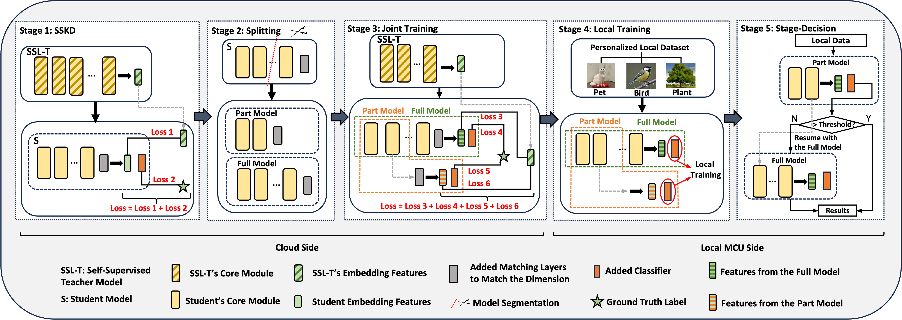
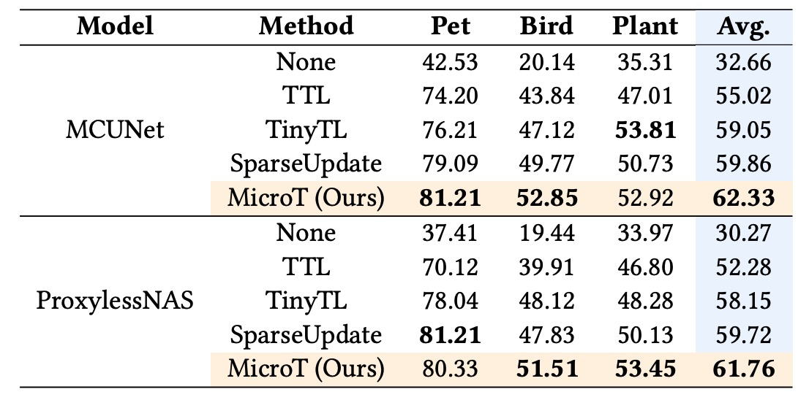
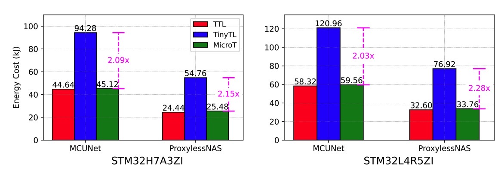
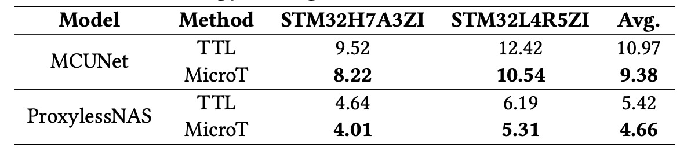

<div align="center">
  <h1>Towards Low-Energy Adaptive Personalization for Resource-Constrained Devices</h1>
</div>


<p align="center">
  <strong><a href="https://arxiv.org/abs/2403.08040">[Paper]</a></strong>
  <strong><a href="https://netsys.doc.ic.ac.uk/">[Team]</a></strong>
</p>

Accepted to *[The 9th ACM/IEEE Symposium on Edge Computing (SEC 2024)](https://acm-ieee-sec.org/2024/)).*


## Abstract 
Microcontroller Units (MCUs) are ideal platforms for edge applications due to their low cost and energy consumption, and are widely used in various applications, including personalized machine learning tasks, where customized models can enhance the task adaptation. However, existing approaches for local on-device personalization mostly support simple ML architectures or require complex local pre-training/training, leading to high energy consumption and negating the low-energy advantage of MCUs. 

In this paper, we introduce MicroT, an efficient and low-energy MCU personalization approach. MicroT includes a robust, general, but tiny feature extractor, developed through self-supervised knowledge distillation, which trains a task-specific head to enable independent on-device personalization with minimal energy and computational requirements. MicroT implements an MCU-optimized early-exit inference mechanism called stage-decision to further reduce energy costs. This mechanism allows for user-configurable exit criteria (stage-decision ratio) to adaptively balance energy cost with model performance. We evaluated $MicroT$ using two models, three datasets, and two MCU boards. MicroT outperforms traditional transfer learning (TTL) and two SOTA approaches by 2.12 - 11.60% across two models and three datasets. Targeting widely used energy-aware edge devices, MicroT's on-device training requires no additional complex operations, halving the energy cost compared to SOTA approaches by up to 2.28X while keeping SRAM usage below 1MB. During local inference, MicroT reduces energy cost by 14.17% compared to TTL across two boards and two datasets, highlighting its suitability for long-term use on energy-aware resource-constrained MCUs.

<div align="center">
 
</div>

<div align="center">
  <h5>System Overview</h5>
</div>

For model performance, MicroT with 0.5 stage-decision ratio outperforms by 2.12 - 11.60%.

<div align="center">
 
</div>

For local training on MCUs, MicroT with 0.5 stage-decision ratio reduce the energy cost by up to 2.28X.

<div align="center">
 
</div>

For local inference on MCUs, MicroT with 0.5 stage-decision ratio reduce the energy cost by 14.17%.

<div align="center">
 
</div>

We also provide the model performance and system cost evaluations with other stage-decision ratios, please refer to the paper. 

## 1. Requirements
To get started and download all dependencies, run:

```
pip install -r requirements.txt 
```
For the dataset, we use the Oxford-iiit Pet (pet) [1], The caltech-ucsd birds-200-2011 (bird) [2], and LifeCLEF 2017 (plant) [3]. 

For the model, we use MCUNet_int3 and ProxylessNAS_w0.3 [4].

Please refer to the reference and download them.


## 2. Self-Supervised Knowledge Distillation (SSKD)

For the self-supervised teacher model, we utilize DINOv2_small [5], please refer to the reference and download related model and library. 


The code for SSKD is in `SSKD.py`, here we utilized MCUNet as an example.


## 3. Joint Training

The code for Joint Training is similar to SSKD, with the difference being the addition of a linear layer to the Part Model to match the dimensionality of the teacher model's embedding features. Additionally, other loss functions need to be incorporated, as referenced in the System Overview figure. For details on obtaining the Part Model:

```python
import torch
import torch.nn as nn

class PartialModel(nn.Module):
    def __init__(self, original_model, cut_point=9, num_features=40, num_classes=160):
        super(PartialModel, self).__init__()
        self.feature_extractor = nn.Sequential(
            original_model.first_conv, 
            *original_model.blocks[0:cut_point]  # please revise the number to determin the optimal segmentation point
        )
        self.global_avg_pool = nn.AdaptiveAvgPool2d(output_size=1)

    def forward(self, x):
        features = self.feature_extractor(x)
        pooled_features = self.global_avg_pool(features)
        flattened_features = pooled_features.view(pooled_features.size(0), -1)
        return flattened_features
```

## 4. Classifier Training

The classifier training needs to be performed locally on the MCU. However, to facilitate quick validation of the method for readers, we provide a Python version here (`ClassifierTraining.py`). If you need to train the Part Model, please active and utilize `class PartialModel()` to build and initialize the Part Model.

For local training on the MCU, we use STM32CUBEIDE and write the code in C.

## 5. Median Calculation

For the median value calculation, please refer to `median_calculation.py`.

## 5. Quantization

We also provided the pipeline to quantize PyTorch model (Torch → ONNX → TensorFlow → TFLite), please refer to `quantization.ipynb`.

We utilized onnx2tf toolbox, please refer to [6].


## Citation

If you found our work useful please consider citing it:

```bibtex
@misc{huang2024lowenergyondevicepersonalizationmcus,
      title={Low-Energy On-Device Personalization for MCUs}, 
      author={Yushan Huang and Ranya Aloufi and Xavier Cadet and Yuchen Zhao and Payam Barnaghi and Hamed Haddadi},
      year={2024},
      eprint={2403.08040},
      archivePrefix={arXiv},
      primaryClass={cs.LG},
      url={https://arxiv.org/abs/2403.08040}, 
}
```

## Acknowledgments

We would like to express our gratitude to all references in our paper for their open-sourcing of the codebase, methodology, and dataset, which served as the foundation for our work.


## References

[1] Omkar M Parkhi, Andrea Vedaldi, Andrew Zisserman, and C. V. Jawahar. The oxford-iiit pet dataset.

[2] C. Wah, S. Branson, P. Welinder, P. Perona, and S. Belongie. The caltech-ucsd birds-200-2011 dataset. Technical Report CNS-TR-2011-001, California Institute of Technology, 2011.

[3] Herve Goeau, Pierre Bonnet, and Alexis Joly. Plant identification based on noisy web data: the amazing performance of deep learning (lifeclef 2017). CEUR Workshop Proceedings, 2017.

[4] Lin, Ji, Wei-Ming Chen, Yujun Lin, Chuang Gan, and Song Han. "Mcunet: Tiny deep learning on iot devices." Advances in neural information processing systems 33 (2020): 11711-11722.

[5] Oquab, Maxime, Timothée Darcet, Théo Moutakanni, Huy Vo, Marc Szafraniec, Vasil Khalidov, Pierre Fernandez et al. "Dinov2: Learning robust visual features without supervision." arXiv preprint arXiv:2304.07193 (2023).

[6] onnx2tf, https://github.com/PINTO0309/onnx2tf
